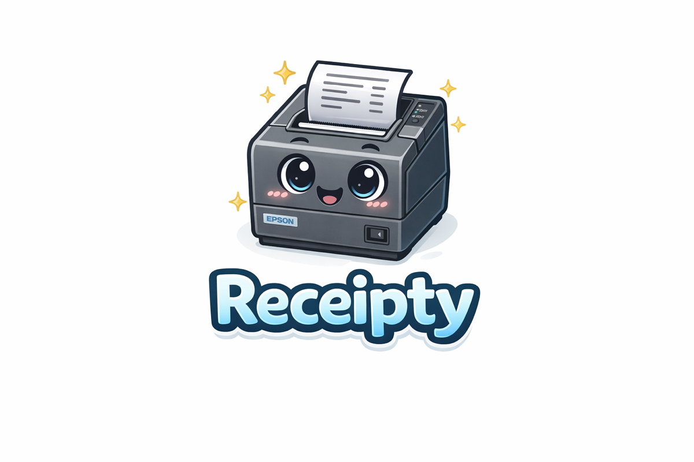

# Receipt Printer Control Web App

<p align="center">
  
</p>

A lightweight web UI and API to send plain-text jobs to an Epson TM-T88IV receipt printer over USB or Ethernet. Includes job logging, status checks, and Docker-first setup.

## Features
- Immediate print submit with queued job ids
- Printer status checks and readiness endpoints
- SQLite-backed job audit trail with error stacks
- Reprint previous jobs from the Activity log
- Drag-and-drop image printing (PNG/JPEG/GIF/BMP)
- Printer control page (feed, cut, status report, status printout)
- USB device path override and Ethernet RAW TCP
- Docker Compose profiles for usb and ethernet (Docker Hub image)

## Quick Start (Local)
```bash
npm install
npm run dev
```

Create `.env` from the example below and run the server. By default it binds to `127.0.0.1:3000`.

## Docker Compose
Profiles are required for usb/ethernet. If you omit `--profile`, Compose will report "no service selected".
```bash
docker compose --profile ethernet pull
docker compose --profile ethernet up -d
```

For USB, ensure device mappings match your host:
```bash
docker compose --profile usb pull
docker compose --profile usb up -d
```

### Docker Hub (remote servers)
Compose uses the published image by default. If you want to build locally instead, swap `image:` for `build: .` in `docker-compose.yml`.

If the container fails with `SQLITE_CANTOPEN`, ensure the data volume is writable:
```bash
docker compose --profile ethernet run --rm --user root receipty-ethernet \
  sh -c "mkdir -p /app/data && chown -R node:node /app/data"
```

## Configuration
Config is driven by environment variables and an optional JSON file.
- Optional file: set `CONFIG_PATH=/config/receipty.json` and mount it into the container.
- Environment variables override values from the file.

### Environment variables
| Name | Required | Example | Notes |
|---|---:|---|---|
| `PRINTER_MODE` | Yes | `ethernet` | `usb` or `ethernet` |
| `APP_HOST` | Yes | `127.0.0.1` | Require API key if `0.0.0.0` |
| `APP_PORT` | Yes | `3000` | HTTP port |
| `API_KEY` | Conditional | `changeme` | Required when exposed |
| `RATE_LIMIT_PER_MINUTE` | No | `60` | Per IP |
| `MAX_CHARS` | No | `1000` | Input limit |
| `FEED_LINES` | No | `6` | Line feeds after text |
| `CUT_FEED_LINES` | No | `3` | Extra line feeds before cutting |
| `CUT_MODE` | No | `partial` | `none` `partial` `full` |
| `CONNECT_TIMEOUT_MS` | No | `2000` | Ethernet |
| `WRITE_TIMEOUT_MS` | No | `2000` | Ethernet/USB write |
| `DB_PATH` | No | `./data/receipty.sqlite` | SQLite file path |
| `CONFIG_PATH` | No | `/config/receipty.json` | Optional JSON config file |

### USB mode variables
| Name | Required | Example | Notes |
|---|---:|---|---|
| `USB_VENDOR_ID` | Yes | `0x04B8` | Epson VID often |
| `USB_PRODUCT_ID` | Yes | `0x0E15` | Varies by device |
| `USB_DEVICE_PATH` | No | `/dev/usb/lp0` | Optional override |

### Ethernet mode variables
| Name | Required | Example | Notes |
|---|---:|---|---|
| `PRINTER_HOST` | Yes | `192.168.1.50` | IP or DNS |
| `PRINTER_PORT` | No | `9100` | RAW printing |

## API
- `POST /api/print`
  - JSON: `{ "text": "...", "includeText": true, "includeImage": false, "imageBase64": "...", "imageMime": "image/png" }`
  - JSON data URL: `{ "image": "data:image/png;base64,..." }`
  - multipart/form-data fields: `text`, `includeText`, `includeImage`, file field `image`
- `POST /api/jobs/:id/reprint`
- `POST /api/control/feed`
- `POST /api/control/cut`
- `POST /api/control/status` (view report in UI)
- `POST /api/control/status/print` (print report)
- `GET /api/status`
- `GET /api/jobs?page=1&pageSize=20`
- `GET /healthz`
- `GET /readyz`

If `APP_HOST` is not localhost, include `X-API-Key` in API requests.
Image uploads are limited to 5MB.

## Development
```bash
npm run test
npm run build
npm start
```

## Notes
- USB printing uses `escpos-usb` by default and will fall back to writing the raw payload to `USB_DEVICE_PATH` when provided.
- Ethernet printing uses raw TCP with timeouts and retry jitter.
- If USB access fails, try mapping `/dev/bus/usb` first; only use `privileged: true` as a last resort.
- Status report confirmation requires a printer response; USB connections cannot confirm control commands.

## License
MIT. See `LICENSE`.
